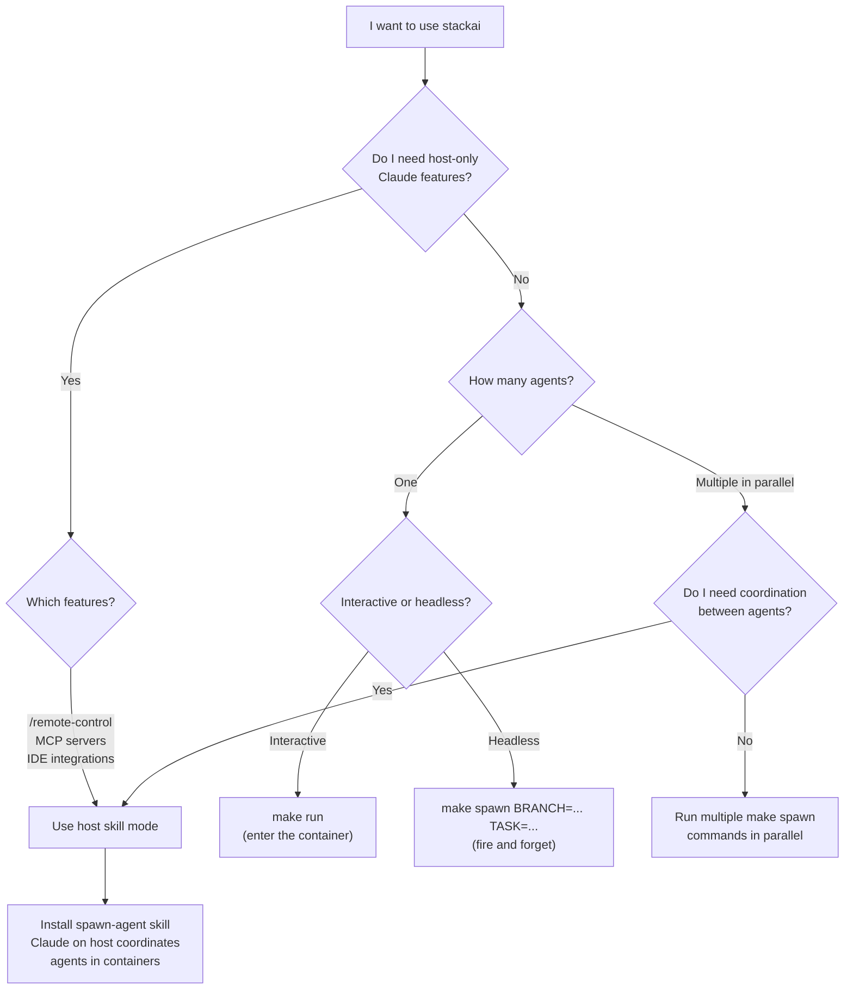

# stackai

[](https://github.com/deimagjas/stackai/actions/workflows/ci.yml)
[](LICENSE)

Run parallel Claude Code agents in sandboxed Apple Containers with isolated git worktrees.

## What is this?

stackai is an infrastructure toolkit that spawns headless Claude Code instances inside lightweight Linux containers on macOS. Each agent works in its own git worktree, enabling parallel development workflows — multiple agents can work on different branches of the same repository simultaneously.

---

## Two ways to use stackai

stackai provides two distinct usage modes. Both rely on the same container image and infrastructure, but differ in **where the orchestration happens**.

### Mode 1: Direct container usage

Use the Makefile or the `q` CLI to build the image, enter a container interactively, or spawn headless agents directly from your terminal.

**Best for:**
- Running Claude interactively inside the container (full Linux environment with Rust CLI tools)
- Spawning one-off headless agents via `make spawn` or `q spawn`
- Automation scripts and CI-driven agent workflows
- Using Claude features that work reliably inside containers

```bash
# Interactive session inside the container
make run

# Spawn a headless agent
make spawn BRANCH=feat/oauth2 TASK="Implement OAuth2 with JWT tokens"
```

### Mode 2: Host skill (spawn-agent)

Install the `spawn-agent` skill in your host Claude Code session. Claude on your host becomes a **coordinator** that delegates tasks to containerized agents and monitors their progress via `container logs`.

**Best for:**
- Orchestrating multiple agents in parallel from a single Claude conversation
- Tasks that require host-side Claude features not yet available inside containers (e.g., `/remote-control`, MCP servers, IDE integrations)
- Complex workflows where the coordinator needs to review agent output and make decisions before spawning the next agent

```
# From your host Claude Code session:
> spawn an agent on feat/oauth2 to implement OAuth2 with JWT tokens
> spawn another on test/auth to write integration tests for the auth module
> check the status of both agents
```

The skill automatically detects the task type (feature, test, mutation, explore) and builds an appropriate prompt for each agent.

### Why both modes?

Some Claude Code features — such as `/remote-control`, MCP tool connections, and certain IDE integrations — are not yet supported inside containers. The host skill mode lets you keep those capabilities on your host while still delegating compute-heavy coding tasks to isolated container agents. As container support matures, more features will work directly inside the container.

### Decision flow



---

## Key components

| Component | Path | Description |
|---|---|---|
| Container image | `config/Dockerfile.wolfi` | ARM64 Wolfi-based image with Claude Code, Rust CLI tools, and Node/Python runtimes |
| Entrypoint | `config/entrypoint.sh` | Credential injection, worktree creation, headless agent launch |
| Makefile | `config/Makefile` | Build, spawn, monitor, and stop agents |
| CLI (`q`) | `app/cli/` | Python CLI (Typer) wrapping Makefile targets |
| Spawn skill | `docs/agents/spawn-agent-skill.md` | Host-side Claude Code skill for multi-agent coordination |
| Docs | `docs/agents/` | Architecture, setup, spawn skill, evals |

## Requirements

- macOS 26+ (Sequoia) with Apple Container CLI
- Apple Silicon (ARM64)
- Claude Pro or Max subscription ([claude.ai](https://claude.ai))
- Python 3.13+ and [uv](https://docs.astral.sh/uv/)
- Git

## Quick start

### 1. Build the image

```bash
cd config
make build
```

### 2. Set up authentication

```bash
claude login          # authenticate via browser OAuth
claude setup-token    # generates the container token
export CLAUDE_CONTAINER_OAUTH_TOKEN=<token>
```

See [docs/agents/setup.md](docs/agents/setup.md) for the full dual-token architecture explanation.

### 3. Create the network

```bash
make network
```

### 4. Spawn an agent

```bash
make spawn BRANCH=feat/oauth2 TASK="Implement OAuth2 with JWT tokens"
```

Or using the CLI:

```bash
cd app/cli && uv sync
q spawn --branch feat/oauth2 --task "Implement OAuth2 with JWT tokens"
```

### 5. Monitor

```bash
make list-agents                       # active containers and worktrees
make follow-agent BRANCH=feat/oauth2   # stream logs
make stop-agent BRANCH=feat/oauth2     # stop when done
```

## Project structure

```
stackai/
├── app/
│   ├── cli/                  # Python CLI (q command)
│   └── agents-templates/     # Agent template examples
├── config/
│   ├── Dockerfile.wolfi      # Production image (ARM64, glibc)
│   ├── Dockerfile            # CI image (Alpine, amd64)
│   ├── Makefile              # Build/spawn/monitor targets
│   ├── entrypoint.sh         # Container entrypoint
│   └── spec/                 # ShellSpec BDD tests
├── docs/agents/
│   ├── container-agent.md    # Image and Makefile reference
│   ├── spawn-agent-skill.md  # Spawn skill architecture
│   ├── setup.md              # Authentication guide
│   ├── evals.md              # Evaluation framework
│   └── cli.md                # CLI command reference
├── iac/                      # Infrastructure as Code
└── model/                    # ML fine-tuning experiments
```

## How it works

1. **Build** — `Dockerfile.wolfi` compiles Rust CLI tools (ripgrep, fd, bat, eza, dust, procs, bottom) in a builder stage, then installs Claude Code CLI, Node.js, Python, and GitHub CLI in the runtime stage.

2. **Spawn** — The Makefile creates a git worktree for the target branch, launches a container with read-only credential mounts, and runs `claude --dangerously-skip-permissions -p "<task>"` as a non-root user via `su-exec`.

3. **Isolate** — Each container gets its own worktree under `$AGENTS_HOME`, its own credential copy, and its own `CLAUDE_CODE_OAUTH_TOKEN`. The host credentials are never modified.

4. **Merge** — When the agent finishes, its branch is ready for review and merge via standard git workflow.

## CI

GitHub Actions runs on every push to `main` and on pull requests:

| Job | What it checks |
|---|---|
| `lint` | ruff on `app/cli/` |
| `test-cli` | pytest for the Python CLI |
| `test-entrypoint` | ShellSpec BDD tests for `entrypoint.sh` |
| `dockerfile-lint` | hadolint on both Dockerfiles |
| `docker-build` | Alpine builder stage compilation |

## Documentation

- [Container image and Makefile](docs/agents/container-agent.md)
- [Setup and authentication](docs/agents/setup.md)
- [Spawn agent skill](docs/agents/spawn-agent-skill.md)
- [CLI reference](docs/agents/cli.md)
- [Evals](docs/agents/evals.md)

## License

[Apache 2.0](LICENSE)
